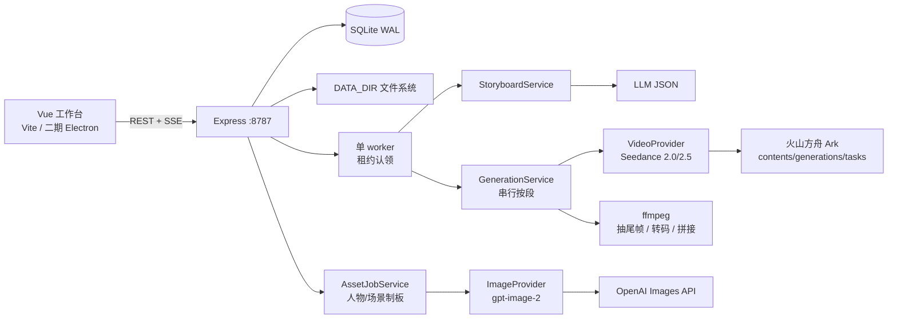
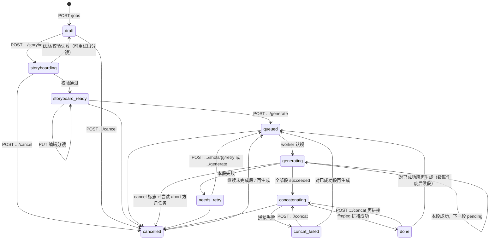
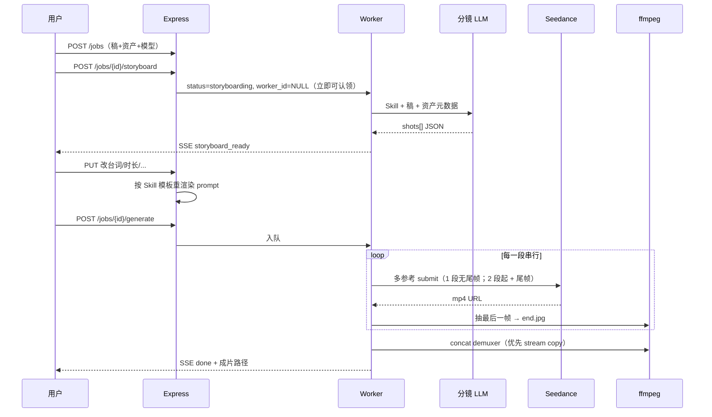

# 数字人口播工作台 · 技术方案

| 项 | 内容 |
|---|---|
| 作者 | TBD |
| 日期 | 2026-08-14 |
| 状态 | Draft |
| 配套产品需求 | [`数字人口播工作台-产品需求.md`](./数字人口播工作台-产品需求.md) |
| 一期 Skill | [`../skills/koubo/SKILL.md`](../skills/koubo/SKILL.md) |
| 人物/场景提示词 | [`../prompts/`](../prompts/) |
| 框架参照 | `/Users/naodoo/data/duanju`（Toonflow-web / Toonflow-app） |

本文服从已对齐的产品决策，不回写调研中被否决的主链路（Hedra / MuseTalk 作为成片引擎、先整篇 TTS 再驱动口型、先合成「人在场景中」首帧）。仓库目前只有产品与调研文档，无应用代码；本文按 **greenfield** 给出可落地选型、目录、数据模型和接口。

**2026-08-14 补：** 技术框架对齐短剧项目 `duanju`（Vue 3 + Express + Knex + SQLite，二期 Electron）。人物 / 场景生图提示词部分参考该仓库，完整模板见 `prompts/`。

---

## Overview

数字人口播工作台是跑在本机 / 内网的单用户（或小团队）Web 应用：把人物多视图、空场景多视图、≤15 秒音色做成全局可复用资产；制作时选资产 + 口播稿 + 口播 Skill + Seedance 全能参考模型，先产出可编辑分镜 JSON，用户改完后再 **串行逐段** 生成视频，第 2 段起挂上一段尾帧，失败按段重试，最后用 ffmpeg 拼接成片。

一期完整闭环落在本机 Node 进程上：Express 编排任务、Knex + better-sqlite3 + 文件系统存资产与成片、进程内单 worker 队列、外部只调图片 / 视频 / LLM 云 API。前端是 Vite + Vue 3 + TDesign 的单页工作台，不直接持有云厂商密钥。栈与短剧 `Toonflow-app` / `Toonflow-web` 同族，便于二期用同一套 Electron 壳打成本地应用。

---

## Background & Motivation

当前仓库只有需求与调研，没有可运行的应用。调研文档评估过专用数字人（Hedra、MuseTalk）和「TTS 锁定时长 → 合成首帧 → 驱动口型」的混合链路；产品已明确不走这条路：

- 声音不单独成篇，只作视频模型的 **音色参考**。
- 第 1 段不合成「人在场景中」的起始图，人物板 + 场景板作为多参考直出。
- 视频只接 **全能参考** 模型（图 + 视频 + 音频 + 文本），一期即 Seedance 2.0 / 2.5。

因此工程问题不是「选哪家数字人 SDK」，而是：

1. 资产（人物 / 场景 / 音色）如何在本地磁盘上可复用、可引用。
2. 如何把 `skills/koubo/SKILL.md` 当成可执行约束，而不是页面文案。
3. 如何把分镜 JSON 当成唯一源，驱动表格、提示词和按段生成。
4. 如何把云端异步视频 API、尾帧抽取、按段失败重试、无损拼接做成可观察、可回滚的任务状态机。

---

## Goals & Non-Goals

### Goals（一期）

- 本机 / 内网可启动，单机默认 **同时只跑 1 个制作任务**，段级串行。
- 三类资产 CRUD + 人物多图制板 + 场景文生/图生/上传 + 浏览器录音 / 本地上传音色。
- 读口播 Skill + 用户稿 + 资产元数据，产出符合 Skill 合同的 `shots[]`；用户可改后再出片。
- Seedance 2.0（4–15s）/ 2.5（4–30s）按段生成；第 2 段起必须挂尾帧；人物板 / 场景板 / 音色每段都挂。
- 图片走 gpt-image-2，可换 provider。
- 画幅 16:9 / 9:16（默认 16:9），分辨率 **480p / 720p**（默认 720p）。
- 失败按段重试，已成功段保留；全段成功后拼接成片并写入任务存档。

### Non-Goals（一期明确不做）

- 多租户 SaaS、账号体系、云对象存储。
- 独立整篇 TTS、口型重定向、Hedra / MuseTalk 主链路。
- UI「选择首帧图」或先合成人在场景中的起始图。
- 纯文生人物、1080p / 4K、字幕 / 花字 / Logo / BGM / 包装。
- 除 `koubo` 以外的 Skill 实现（只留加载接口）。
- Redis / Kubernetes / 多机 worker 集群。
- **一期不打 Electron 包**；桌面壳作为二期，预留目录与 `DATA_DIR` 解析，不阻塞源码启动。

---

## Proposed Design

### 1. 技术选型

| 层 | 推荐 | 理由 |
|---|---|---|
| 前端 | **Vite + Vue 3 + TypeScript + TDesign Vue Next + Pinia** | 与 `duanju/Toonflow-web` 同族，表单/表格/上传/录音组件可直接对照；不需要 SSR。 |
| 后端 | **Node.js 20+ + Express 5 + TypeScript** | 与 `duanju/Toonflow-app` 同族；后续 Electron 主进程拉起同一套 HTTP 服务，不必再塞 Python 运行时。 |
| 校验 | **Zod** | 短剧已用；分镜 JSON、上传、路由入参同一套。 |
| 数据访问 | **Knex + better-sqlite3** | 短剧本地库同款；WAL；`better-sqlite3` 打 Electron 包时 `asarUnpack`。 |
| 存储 | **SQLite + 本地文件系统** | 单机零运维；元数据进库，二进制进盘。 |
| 任务队列 | **进程内单 worker + `jobs` 表认领 + 租约** | 默认并发 1，不引入 Redis。进程 **禁止 cluster 多 worker**。崩溃后按 `provider_request_id` 续 poll 或标失败。 |
| 视频处理 | **系统 ffmpeg / ffprobe**（启动时检查 ≥ 6） | 抽尾帧、转码录音、探测、拼接。二期 Electron 再考虑打进 extraResources。 |
| 图片模型 | **OpenAI `gpt-image-2`** | 产品锁定。提示词模板见 `prompts/`。 |
| 视频模型 | **火山方舟 / BytePlus Seedance 全能参考** | 一期只接官方 Ark，不接 fal。 |
| 分镜 LLM | **国产 OpenAI 兼容网关** + **Vercel AI SDK**（`@ai-sdk/openai-compatible`） | 短剧 `u.Ai.Text` 同思路；`json_schema` 失败回退 `json_object` + Zod。 |
| 实时进度 | **SSE** `GET /api/jobs/{id}/events` | 一期不用 Socket.IO（短剧聊天/Agent 才需要）。 |
| 包管理 | **pnpm workspace**（`apps/web` + `apps/api`） | 锁文件可复现。 |
| 进程管理 | `scripts/dev.sh` 同时起 API:8787 与 Vite:5173 | Vite 代理 `/api`、`/files`。 |
| 桌面（二期） | **Electron + electron-builder** | 对照 `Toonflow-app/scripts/main.ts` 与 `electron-builder.yml`。 |

**对齐短剧、刻意变瘦：** 只借框架与资产生图话术，不搬登录、积分、OSS、MySQL、小说流水线、Socket Agent。

**不选 FastAPI 的原因：** 一期能跑，但二期 Electron 要捆绑 Python/uv，和现有短剧交付形态冲突。ffmpeg 用 `child_process` 调系统二进制即可。

**不选 React / shadcn 的原因：** 工作台交互与短剧资产库同类，TDesign 表格、上传、录音、对话框已够用，少维护两套组件习惯。

**不选 Next.js / Redis / Celery 的原因：** 制作任务是分钟级带磁盘副作用的状态机；一期并发 = 1。

默认视频模型实现指定为 **`seedance-2.0`**（更短、更便宜、更好调试接缝）；UI 可一键切 2.5。产品要求「少切、接得住」，2.5 适合长稿，但不作为联调默认值。一期闭环按 **2–4 周、单人** 估算，不承诺一周九 PR 齐活。

### 2. 仓库目录结构（greenfield）

仓库现状只有 `doc/`、`skills/koubo/SKILL.md` 与 `prompts/`。建议按下面落地，**不假装这些目录已存在**：

```text
voiceover/
├── apps/
│   ├── api/                          # Express + TS（对照 Toonflow-app）
│   │   ├── package.json
│   │   ├── src/
│   │   │   ├── app.ts                # Express、CORS、超时、启动检查 ffmpeg
│   │   │   ├── env.ts
│   │   │   ├── db.ts                 # Knex + better-sqlite3
│   │   │   ├── worker.ts             # 单 worker + 租约
│   │   │   ├── routes/
│   │   │   │   ├── characters.ts
│   │   │   │   ├── scenes.ts
│   │   │   │   ├── voices.ts
│   │   │   │   ├── jobs.ts
│   │   │   │   ├── assetJobs.ts
│   │   │   │   ├── files.ts
│   │   │   │   └── health.ts
│   │   │   ├── services/
│   │   │   │   ├── storage.ts
│   │   │   │   ├── media.ts          # spawn ffmpeg / ffprobe
│   │   │   │   ├── storyboard.ts
│   │   │   │   ├── generation.ts
│   │   │   │   └── events.ts
│   │   │   ├── providers/
│   │   │   │   ├── image.ts
│   │   │   │   ├── imageOpenai.ts
│   │   │   │   ├── video.ts
│   │   │   │   ├── videoArk.ts
│   │   │   │   └── llm.ts            # AI SDK openai-compatible
│   │   │   └── skills/
│   │   │       ├── registry.ts
│   │   │       └── koubo.ts
│   │   └── tests/
│   ├── web/                          # Vite + Vue 3 + TDesign（对照 Toonflow-web）
│   │   ├── package.json
│   │   ├── src/
│   │   │   ├── main.ts
│   │   │   ├── api/client.ts
│   │   │   ├── views/
│   │   │   │   ├── AssetsView.vue
│   │   │   │   ├── ProduceView.vue
│   │   │   │   ├── JobDetailView.vue
│   │   │   │   └── JobsView.vue
│   │   │   └── components/
│   │   │       ├── CharacterForm.vue
│   │   │       ├── SceneForm.vue
│   │   │       ├── VoiceRecorder.vue
│   │   │       ├── StoryboardTable.vue
│   │   │       └── ShotStatus.vue
│   │   └── vite.config.ts
│   └── desktop/                      # 二期 Electron 壳；一期可只放 README
│       ├── package.json
│       ├── electron-builder.yml
│       └── src/main.ts
├── skills/koubo/SKILL.md
├── prompts/                          # 人物/场景制板模板
│   ├── style-prefix.md
│   ├── character-board.md
│   └── scene-board.md
├── doc/
├── data/                             # gitignore；运行时数据根
├── scripts/dev.sh
├── pnpm-workspace.yaml
├── .env.example
└── README.md
```

**`DATA_DIR` 解析（与短剧 `getPath` / `TOONFLOW_DATA_DIR` 同序）：**

1. 环境变量 `VOICEOVER_DATA_DIR` 或 `DATA_DIR`
2. Electron 打包态：`app.getPath("userData")/data`
3. 其他：`process.cwd()/data`

数据库只存相对数据根的路径。

### 2.1 与 duanju 的对齐与不抄

| 对齐 | 不抄 |
|---|---|
| Vue 3 + Vite + TDesign；Express + Knex + better-sqlite3 | 登录、积分、OSS、MySQL、小说/短剧流水线 |
| 进程内任务队列 + 资产「生成中」防重入 | Socket.IO Agent、多 vendor 计费中台 |
| 人物身份锁定 / 空场景禁人 / 全局风格前缀 | 短剧「单张全景禁止四宫格」、16:9 身份板、背面成格 |
| Electron：主进程起 HTTP、userData 放 data、asarUnpack native | 短剧打包资源全集 |
| Vercel AI SDK 调 OpenAI 兼容网关 | 一期只接图片 / LLM / 方舟三处 |

### 2.2 Electron 预留（二期）

一期仍是 `scripts/dev.sh` 源码启动。二期对照 `Toonflow-app/scripts/main.ts` 与 `electron-builder.yml`：

- 主进程：开发态 `loadURL(http://127.0.0.1:5173)`，打包后 `loadFile(userData/data/web/index.html)`，同时在本机拉起 Express（只绑 `127.0.0.1`）。
- 数据：首次启动把 extraResources 里的空库 / skills / prompts 拷到 `userData/data`（短剧 `initializeData`）。
- native：`better-sqlite3` 进 `asarUnpack`；ffmpeg 二期再打进 extraResources，一期继续要求系统安装。
- API 与 UI **零改协议**：桌面壳只换进程宿主。

一期不实现完整 `desktop/`；PR 1 只建目录说明和 `DATA_DIR` 解析。

### 3. 系统架构



图片制板走 `AssetJobService`，**不**在视频生成路径上调 ImageProvider。制板与制作任务（含 `storyboarding`）**共享同一 FIFO worker**，默认排队不互斥拒绝（见 §4）。

制作任务状态机（任务级 + 段级）：



段级状态：`pending` → `generating` → `succeeded` | `failed` | `cancelled`。`failed` / `succeeded` / `cancelled` 均可再进 `generating`（见「已成功段再生成」）。禁止在缺少上一段 `end.jpg` 时生成后一段。

**已成功段再生成（产品 §7.5）**：`POST /api/jobs/{id}/shots/{k}/retry` 允许任务处于 `needs_retry | done | concat_failed | cancelled`，且目标段为 `failed | succeeded | cancelled | pending`。重试第 *k* 段时：

1. 把第 *k* 段标 `pending`（旧 `video.mp4` 改名为 `video.attempt{n}.mp4`）。
2. 将所有 `index > k` 的 `shot_runs` 重置为 `pending`，清空其 `video_path` / `end_frame_path` / `provider_request_id`（文件改名为 `*.stale.*`，不删以便回看）。
3. 清空 `jobs.final_video_path`（成片基于旧尾帧，必须作废）。
4. 任务进入 `queued`，worker 从第 *k* 段起串行重跑。

**分辨率 / 模型变更**：`PATCH /api/jobs/{id}` 仅当 **没有任何** `succeeded` 的 `shot_runs` 时允许改 `resolution` / `video_model` / `aspect_ratio`。若已有成功段，返回 409，提示先「全部重跑」（`POST .../generate { "rerun_all": true }`，等价于对第 1 段 retry）。禁止 480p 成功段与新 720p 段混拼。



### 4. 容量与时延（单机内网估算）

| 项 | 一期假设 |
|---|---|
| 并发 | 全局 **一条** FIFO worker 队列（`jobs` ∪ `asset_jobs` 按 `created_at`）。新制板、新分镜、新出片默认都 **入队**（`201 queued`），不因另一类任务在跑而 409。可选 `?if_busy=reject`：当已有 `jobs.status ∈ {queued,storyboarding,generating,concatenating}` 或 `asset_jobs.status ∈ {queued,generating}` 时返回 409 `worker_busy`。同一时刻只跑一件。 |
| 分镜 LLM | 5–30 s；失败自动再试 1 次。 |
| 人物/场景制板 | gpt-image-2 约 20–90 s / 张。 |
| 单段视频 | 云队列 + 推理，常见 **1–8 min**；按 15 s / 720p 计。 |
| 抽尾帧 / 拼接 | ffmpeg 本机，抽帧 < 2 s；1 分钟成片 stream copy < 5 s。 |
| 1 分钟成片存储 | 2–4 段 720p MP4（每段约 4–15 MB）+ 尾帧 JPEG（每张 100–400 KB）+ 成片约 15–40 MB；**单任务 50–120 MB** 粗算。 |
| 资产 | 人物/场景板 PNG 2–8 MB；音色 ≤15 s WAV/MP3 < 3 MB。 |
| 费用量级（仅视频，未计重试） | 方舟按 **token** 计费（2026-08 公开价：Seedance 2.5 约 42/70 元/百万 token，视是否含视频输入；2.0 约 28 元起/百万 token）。720p 一分钟成片常见 **数十元人民币** 量级，重试接近翻倍。实现用响应里的 `usage` 落盘，**以开通账号价格页为准**，不把 fal 美元单价写进 UI。 |

---

## Data Model Changes

### 磁盘约定

所有路径相对 `DATA_DIR`（默认 `./data`）。ID 一律 `ulid`（可排序）。

```text
data/
  app.db
  characters/<id>/
    sources/01_front.jpg
    sources/02_side.jpg
    sources/03_back.jpg          # 仅制板输入，不进最终四格
    sources/04_mouth.jpg
    board.png                    # 核心交付物：四格人物多视图
  scenes/<id>/
    sources/ref.png              # 图生图原图，可空
    board.png                    # 核心交付物：四格场景多视图（无人）
  voices/<id>/
    sample.wav                   # 统一转 48 kHz / 16-bit PCM WAV（单声道或立体声原声道）
  jobs/<id>/
    storyboard.json              # Skill 合同 JSON，分镜**唯一源**
    llm_raw.json                 # 原始 LLM 输出，便于排错
    shots/01/video.mp4
    shots/01/end.jpg
    shots/01/request.json        # 送给 VideoProvider 的最终 payload（无 API key）
    shots/01/provider.json       # request_id / seed / 耗时
    shots/01/log.txt
    concat.txt                   # ffmpeg concat demuxer 清单
    final.mp4
    logs/job.jsonl
```

**分镜唯一源**：`data/jobs/<id>/storyboard.json`。`jobs` 表只存 `storyboard_path` 指针，**不**再存一份完整 JSON。`GET /api/jobs/{id}` 从磁盘读入。每次 `PUT` 分镜都先写临时文件再 `os.replace` 原子覆盖。

### 静态文件路由

```text
GET /files/{kind}/{id}/{rel:path}
kind ∈ {characters, scenes, voices, jobs}
```

`storage.resolve(kind, id, rel)`：

1. `id` 必须匹配 `^[0-9A-HJKMNP-TV-Z]{26}$`（ULID）。
2. `rel` 规范化后不得含 `..`、不得为绝对路径；`Path(DATA_DIR, kind, id, rel).resolve()` 必须仍以 `DATA_DIR/kind/id/` 为前缀；拒绝 symlink 逃出该目录。
3. `rel` 必须匹配下列之一（PR 2 落地）：

| kind | 允许的 `rel` |
|---|---|
| characters / scenes | `board(\.prev)?\.png`、`sources/<file>`（`<file>` = `[A-Za-z0-9._-]{1,80}`，扩展名 jpg/jpeg/png/webp） |
| voices | `sample.wav` |
| jobs | `storyboard.json`、`final(\.prev)?\.mp4`、`shots/<nn>/(video\|end\|request\|provider)(\.(attempt\|stale)\d+)?\.(mp4\|jpg\|json)`、`shots/<nn>/log.txt` |

未匹配 → 404，不回目录列表。此路由在 PR 2 与 CRUD 一起交付。

### SQLite 表

```sql
PRAGMA journal_mode=WAL;
PRAGMA foreign_keys=ON;

CREATE TABLE characters (
  id            TEXT PRIMARY KEY,
  name          TEXT NOT NULL,
  bio           TEXT NOT NULL DEFAULT '',
  default_voice_id TEXT,                -- 逻辑 FK → voices.id；插入时必须先 NULL
  source_kind   TEXT NOT NULL,          -- upload_board | generated
  board_path    TEXT,                   -- characters/<id>/board.png
  created_at    TEXT NOT NULL,
  updated_at    TEXT NOT NULL
);

CREATE TABLE character_sources (
  id            TEXT PRIMARY KEY,
  character_id  TEXT NOT NULL REFERENCES characters(id) ON DELETE CASCADE,
  role          TEXT NOT NULL,          -- front | side | back | mouth | other
  path          TEXT NOT NULL,
  sort_order    INTEGER NOT NULL DEFAULT 0
);

CREATE TABLE scenes (
  id            TEXT PRIMARY KEY,
  name          TEXT NOT NULL,
  bio           TEXT NOT NULL DEFAULT '',
  source_kind   TEXT NOT NULL,          -- upload | t2i | i2i
  gen_prompt    TEXT,                   -- 文生/图生时的用户提示
  board_path    TEXT,
  created_at    TEXT NOT NULL,
  updated_at    TEXT NOT NULL
);

CREATE TABLE voices (
  id            TEXT PRIMARY KEY,
  name          TEXT NOT NULL,
  bio           TEXT NOT NULL DEFAULT '',
  character_id  TEXT REFERENCES characters(id) ON DELETE SET NULL,
  audio_path    TEXT NOT NULL,
  duration_ms   INTEGER NOT NULL,
  mime          TEXT NOT NULL DEFAULT 'audio/wav',
  created_at    TEXT NOT NULL,
  updated_at    TEXT NOT NULL
);

-- 人物 ↔ 音色双向绑定：禁止在 INSERT 时同时写两边 FK。
-- 1) POST /characters 忽略尚不存在的 default_voice_id（存 NULL）。
-- 2) POST /voices 可带 character_id；写入后若该人物 default_voice_id 仍为空，则回填。
-- 3) 改绑一律 PATCH。删除音色时应用层把 characters.default_voice_id 置 NULL。
-- 不在 characters.default_voice_id 上建 REFERENCES，避免循环 FK 无法插入。

CREATE TABLE jobs (
  id                   TEXT PRIMARY KEY,
  title                TEXT NOT NULL DEFAULT '',
  script               TEXT NOT NULL DEFAULT '',
  character_id         TEXT REFERENCES characters(id),
  scene_id             TEXT REFERENCES scenes(id),
  voice_id             TEXT REFERENCES voices(id),
  character_name_snap  TEXT,
  scene_name_snap      TEXT,
  voice_name_snap      TEXT,
  skill                TEXT NOT NULL DEFAULT 'koubo',
  video_model          TEXT NOT NULL DEFAULT 'seedance-2.0',
  aspect_ratio         TEXT NOT NULL DEFAULT '16:9',   -- 16:9 | 9:16
  resolution           TEXT NOT NULL DEFAULT '720p',   -- 480p | 720p
  stance               TEXT,                           -- 坐 | 站
  storyboard_path      TEXT,                           -- jobs/<id>/storyboard.json
  status               TEXT NOT NULL DEFAULT 'draft',
  error                TEXT,
  final_video_path     TEXT,
  worker_id            TEXT,                           -- 认领者，单进程常量 "local-1"
  claimed_at           TEXT,
  lease_expires_at     TEXT,                           -- 心跳续约，默认 60s
  cancel_requested     INTEGER NOT NULL DEFAULT 0,
  created_at           TEXT NOT NULL,
  updated_at           TEXT NOT NULL
);

CREATE TABLE shot_runs (
  id                   TEXT PRIMARY KEY,
  job_id               TEXT NOT NULL REFERENCES jobs(id) ON DELETE CASCADE,
  shot_index           INTEGER NOT NULL,
  status               TEXT NOT NULL,   -- pending | generating | succeeded | failed | cancelled
  attempt              INTEGER NOT NULL DEFAULT 0,
  video_path           TEXT,
  end_frame_path       TEXT,
  provider_request_id  TEXT,            -- submit 成功后立刻写入，崩溃后续 poll
  seed                 INTEGER,
  error                TEXT,
  started_at           TEXT,
  finished_at          TEXT,
  UNIQUE (job_id, shot_index)
);
-- shot_runs 只在 POST .../generate 或 retry 时创建/重置。
-- prompt_override 不在本表，见 storyboard.json shots[].prompt_override。

CREATE TABLE asset_jobs (
  id               TEXT PRIMARY KEY,
  kind             TEXT NOT NULL,       -- character_board | scene_board
  target_id        TEXT NOT NULL,       -- characters.id 或 scenes.id
  status           TEXT NOT NULL,       -- queued | generating | succeeded | failed
  error            TEXT,
  result_path      TEXT,
  worker_id        TEXT,
  claimed_at       TEXT,
  lease_expires_at TEXT,
  cancel_requested INTEGER NOT NULL DEFAULT 0,
  created_at       TEXT NOT NULL,
  updated_at       TEXT NOT NULL
);
CREATE INDEX asset_jobs_target_inflight
  ON asset_jobs(target_id, status);     -- 查 queued|generating 去重

CREATE TABLE job_events (
  id         INTEGER PRIMARY KEY AUTOINCREMENT,
  job_id     TEXT NOT NULL,             -- 制作任务 id，或 asset_jobs 用 "asset:<id>"
  ts         TEXT NOT NULL,
  level      TEXT NOT NULL,             -- info | warn | error
  event_type TEXT NOT NULL,             -- snapshot|shot_progress|shot_done|shot_failed|concat_done|concat_failed|cancelled|error|asset_progress
  shot_index INTEGER,
  message    TEXT NOT NULL,
  extra_json TEXT
);
CREATE INDEX job_events_job_id ON job_events(job_id, id);
```

资产删除策略：制作任务只存资产 ID + **名称快照**。删除资产时，若仍被 `jobs` 引用则拒绝（409）。一期不用软删除。

### 分镜 JSON（唯一源）

字段名 **必须** 与 [`skills/koubo/SKILL.md`](../skills/koubo/SKILL.md) 的工作台 JSON 一致，禁止另起一套：

```json
{
  "skill": "koubo",
  "model": "seedance-2.0",
  "aspect_ratio": "16:9",
  "resolution": "720p",
  "stance": "坐",
  "assets": {
    "character": "李主播",
    "scene": "演播室",
    "voice": "李主播默认音色"
  },
  "shots": [
    {
      "index": 1,
      "dialogue": "原文台词",
      "duration_sec": 12,
      "shot_size": "中近景",
      "camera": "固定",
      "stance": "坐",
      "facing": "面向镜头",
      "action": "(开篇) 双手搭桌，自然说话",
      "emotion": "沉稳",
      "visual": "中近景胸像，坐在演播台后，面光，正对镜头",
      "continuity": "开篇",
      "end_frame": "面向镜头，双手搭桌沿，嘴自然闭合",
      "prompt": "视频组全文，含参考绑定和分时提示词",
      "prompt_override": false
    }
  ]
}
```

`continuity` 仅允许 `开篇` | `承接上段尾帧`。`shots[].prompt` 是可直接送给模型的完整视频组文本。`prompt_override` 是工作台扩展字段（Skill 合同之外），用户手改 `prompt` 后为 `true`；`rerender_prompts` 跳过这些段。LLM 输出缺省该字段时服务端填 `false`。

Zod 镜像（`apps/api/src/schemas/storyboard.ts`）：

```ts
const StoryboardAssets = z.object({
  character: z.string(),
  scene: z.string(),
  voice: z.string(),
});

const Shot = z.object({
  index: z.number().int(),
  dialogue: z.string(),
  duration_sec: z.number(),
  shot_size: z.enum(["中近景", "近景", "中景"]),
  camera: z.enum(["固定", "固定，后段极轻 Dolly In"]),
  stance: z.enum(["坐", "站"]),
  facing: z.string(),
  action: z.string(),
  emotion: z.string(),
  visual: z.string(),
  continuity: z.enum(["开篇", "承接上段尾帧"]),
  end_frame: z.string(),
  prompt: z.string(),
  prompt_override: z.boolean().default(false),
});

const Storyboard = z.object({
  skill: z.literal("koubo"),
  model: z.enum(["seedance-2.0", "seedance-2.5"]),
  aspect_ratio: z.enum(["16:9", "9:16"]),
  resolution: z.enum(["480p", "720p"]),
  stance: z.enum(["坐", "站"]),
  assets: StoryboardAssets,
  shots: z.array(Shot),
});
```

无独立迁移框架：greenfield 直接建表。后续改列对照短剧 `fixDB.ts` 做 `addIfMissing`，初期 `CREATE TABLE IF NOT EXISTS`。

---

## API / Interface Changes

前缀 `/api`。JSON；上传用 `multipart/form-data`。错误形如：

```json
{ "error": { "code": "validation_failed", "message": "第 2 段时长 32s 超过 seedance-2.0 上限 15s" } }
```

### 配置与健康

`GET /api/health` → `{ "ok": true, "ffmpeg": "6.1.1", "data_dir": "...", "worker": "idle" }`

`GET /api/config`（无密钥）：

```json
{
  "video_models": [
    { "id": "seedance-2.0", "label": "Seedance 2.0", "min_sec": 4, "max_sec": 15 },
    { "id": "seedance-2.5", "label": "Seedance 2.5", "min_sec": 4, "max_sec": 30 }
  ],
  "image_models": [{ "id": "gpt-image-2", "label": "gpt-image-2" }],
  "skills": [{ "id": "koubo", "label": "口播", "path": "skills/koubo/SKILL.md" }],
  "defaults": { "video_model": "seedance-2.0", "aspect_ratio": "16:9", "resolution": "720p" },
  "limits": { "voice_max_sec": 15, "image_max_mb": 20, "audio_max_mb": 15 }
}
```

### 人物

`GET /api/characters` → `{ "items": [Character] }`

`POST /api/characters` `multipart`：

| 字段 | 说明 |
|---|---|
| `name`, `bio` | 必填名称 |
| `default_voice_id` | 可选；若该音色尚不存在则忽略并记 warn，人物以 `NULL` 入库 |
| `mode` | `upload_board` \| `generate` |
| `board` | `upload_board` 时的成品多视图 |
| `sources` | `generate` 时多张原图（建议 front/side/back/mouth） |
| `source_roles` | 与 `sources` 对齐的角色数组 |

响应 `201` `Character`。`mode=generate` 时先入库源图，`board_path=null`，再 `POST /api/characters/{id}/generate-board` 入队制板。

```json
{ "id": "01HIMG...", "kind": "character_board", "target_id": "01H...", "status": "queued" }
```

`GET /api/asset-jobs/{id}` 返回同一形状，另加 `error`、`result_url`（成功后为 `/files/characters/<id>/board.png`）。前端每 2 s 轮询，或 `GET /api/asset-jobs/{id}/events` SSE。

**入队规则（与 §4 一致）**：默认 FIFO `201 queued`，即使制作任务正在跑。`?if_busy=reject` 时若 worker 队列非空则 409 `worker_busy`。同一 `target_id` 已有 `queued|generating` 的制板 → **409 `board_job_in_flight`**（不建第二行，避免两人同时写 `board.png`）。已有成功板再点生成：无在途任务则新建一行，成功后把旧板改名为 `board.prev.png`。

`PATCH /api/characters/{id}`：改名称 / 简介 / 默认音色（音色必须已存在）。  
`DELETE`：无任务引用则删库 + 删目录。

### 场景

`POST /api/scenes` 与人物对称：`mode=upload` multipart 上传 `board`；`mode=t2i` JSON `{ name, bio, prompt }`；`mode=i2i` multipart `ref` + `prompt`。t2i/i2i 入库后 `board_path=null`。

`POST /api/scenes/{id}/generate` 与人物制板 **同一形状**：返回 `asset_jobs` 行（`kind=scene_board`），用 `GET /api/asset-jobs/{id}` 查询。禁止内存-only 任务。

### 音色

`POST /api/voices` multipart：`name`, `bio`, `character_id?`, `audio`（webm/wav/mp3/m4a）。

服务端：

1. 魔数校验 MIME。
2. ffmpeg 转为 **48 kHz / 16-bit PCM WAV**（`sample.wav`）。不保留 mp3 作为交付物（方舟音频参考常见 WAV/MP3，统一 WAV 少一条转码分支；具体 MIME **以开通账号文档为准**）。
3. `ffprobe` 时长，`> 15000 ms` → 400。
4. 插入 `voices`。若带了 `character_id`：写入后若该人物 `default_voice_id IS NULL`，则回填；已有默认音色则只建立 `voices.character_id` 反向关联，不覆盖。

浏览器录音：前端 `MediaRecorder` 出 webm/opus，走同一上传接口。

### 制作任务

`POST /api/jobs`

```json
{
  "title": "产品发布口播",
  "script": "各位好，今天……",
  "character_id": "01H...",
  "scene_id": "01H...",
  "voice_id": "01H...",
  "skill": "koubo",
  "video_model": "seedance-2.0",
  "aspect_ratio": "16:9",
  "resolution": "720p",
  "stance": null
}
```

服务端快照资产名称；`stance` 为空则按场景名/简介用口播规则推断（演播室/会议室→坐，讲台→站，否则站）。

`GET /api/jobs?limit=50`：按 `created_at DESC` 列表，`{ "items": [ { id, title, status, created_at, character_name_snap, ... } ] }`。

`PATCH /api/jobs/{id}`：draft / storyboard_ready 可改稿、资产、stance。`resolution` / `video_model` / `aspect_ratio` 仅当该任务 **零条** `shot_runs.status='succeeded'` 时允许；否则 409，需 `POST .../generate { "rerun_all": true }`。

`POST /api/jobs/{id}/storyboard`：**始终异步**。任务 → `storyboarding`，`worker_id=NULL`，`lease_expires_at=NULL`，立即 `{ "id", "status": "storyboarding" }`。认领条件见生成管线（`worker_id IS NULL` 的 `storyboarding` **立刻**可被拿走，不必等 60s）。Worker 跑 LLM；成功写 `storyboard.json` 并 → `storyboard_ready`；失败回 `draft` 且 `error` 可读。前端 SSE / 2 s 轮询。不要同步卡 30 s HTTP。PR 8a 单测：POST storyboard 后 worker 在同一事件循环内开始调 LLM。

`PUT /api/jobs/{id}/storyboard`（仅 `storyboard_ready | needs_retry | done | concat_failed | cancelled`，`generating` 时 409）：

```json
{
  "shots": [ { "index": 1, "dialogue": "...", "duration_sec": 11.5, "prompt_override": false } ],
  "rerender_prompts": true,
  "invalidate_runs": false
}
```

`rerender_prompts=true`（默认）时，对 `prompt_override != true` 的段用 Skill 模板重写 `prompt`。用户在表格里直接改 `prompt` 时，前端把该段 `prompt_override` 设为 `true` 一并 PUT。`POST /api/jobs/{id}/shots/{index}/render-prompt` 将该段 override 清掉并重渲染。

**与已有 `shot_runs` 同步**（PUT 之后、同一事务）：

1. 字段编辑（台词/时长/运镜等）且 `index` 集合不变：只写 `storyboard.json`，不动 `shot_runs`。
2. `index` 集合变化（增/删/重排）且 `invalidate_runs=false`：409 `structural_edit_requires_invalidate`，body 列出 old/new indices。
3. `invalidate_runs=true` 或集合不变但调用方显式要求：`sync_shot_runs(job, shots)`——现有 index 保留行；新增 index 插 `pending`；被删 index 标 `cancelled` 并把文件改名为 `*.stale{n}.*`；从 **最小被删/被改序号** 起按再生成规则级联（其 `end.jpg` 链已断）。`run_job` / retry **按当前 `storyboard.shots` upsert**，禁止假定行集与旧分镜 1:1。

`POST /api/jobs/{id}/generate`：任务可处于 `storyboard_ready | needs_retry | done | concat_failed | cancelled`。校验时长/逐字台词后按 **当前** `storyboard.shots` upsert `shot_runs`（缺的建 `pending`，多余的标 `cancelled`），`status=queued`。`{ "rerun_all": true }` 等价于对第 1 段 retry。从 `cancelled` 点生成 =「继续未完成段」：已 `succeeded` 的段跳过，从第一段非成功处接着跑。

`POST /api/jobs/{id}/shots/{index}/retry`：见状态机「已成功段再生成」。任务可处于 `needs_retry | done | concat_failed | cancelled`。目标段允许 `failed | succeeded | cancelled | pending`；前一段必须有 `end.jpg`（第 1 段除外）。可带 `{ "prompt": "..." }`（同时把该段 `prompt_override=true` 写回 `storyboard.json`）。若该 `index` 尚无 `shot_run`，先按当前分镜 upsert 再重试。

`POST /api/jobs/{id}/concat`：全部 `succeeded` 且任务 ∈ `{done, concat_failed, needs_retry}`（`needs_retry` 且全成功时用于手工再拼）。`done → concatenating` 允许覆盖 `final.mp4`（旧文件改名为 `final.prev.mp4`）。

`POST /api/jobs/{id}/cancel`：

| 当前状态 | 行为 |
|---|---|
| draft / storyboard_ready / queued / needs_retry | 立即 `cancelled` |
| generating / concatenating / storyboarding | 置 `cancel_requested=1`；worker 在段边界或 poll 循环读到后：对当前方舟任务调 `VideoProvider.cancel`；当前段 `cancelled`；已成功段保留；任务 `cancelled` |
| done | 409（应走再拼接 / 再生成，不是 cancel） |
| cancelled | 409（已取消；用 generate / retry「继续未完成段」） |

已向方舟提交并开始计费的用量 **无法退款**，UI 文案写明。

`POST /api/admin/worker/pause` 与 `.../resume`：停心跳认领，供维护；进行中的 poll 会跑完当前 `status()` 一轮再停。

`GET /api/jobs/{id}`：

```json
{
  "id": "01H...",
  "status": "needs_retry",
  "script": "...",
  "assets": {
    "character": { "id": "...", "name": "李主播", "board_url": "/files/characters/.../board.png" },
    "scene": { "id": "...", "name": "演播室", "board_url": "/files/scenes/.../board.png" },
    "voice": { "id": "...", "name": "默认", "audio_url": "/files/voices/.../sample.wav", "duration_ms": 8200 }
  },
  "video_model": "seedance-2.0",
  "aspect_ratio": "16:9",
  "resolution": "720p",
  "stance": "坐",
  "storyboard": { "skill": "koubo", "shots": [] },
  "shot_runs": [
    {
      "index": 1,
      "status": "succeeded",
      "attempt": 1,
      "video_url": "/files/jobs/.../shots/01/video.mp4",
      "end_frame_url": "/files/jobs/.../shots/01/end.jpg",
      "error": null
    },
    { "index": 2, "status": "failed", "attempt": 1, "error": "provider_moderation: face similarity" }
  ],
  "final_video_url": null,
  "events_url": "/api/jobs/01H.../events"
}
```

`GET /api/jobs/{id}/events`：SSE。**发布模型**：worker / 路由在与状态变更 **同一 SQLite 事务** 里插入 `job_events`；SSE 处理器记录客户端 `Last-Event-ID`（或查询参数 `after=`），每 **500 ms** `SELECT * FROM job_events WHERE job_id=? AND id > ? ORDER BY id`。连接时先发一条 `event: snapshot`，body 为当时的 `GET /api/jobs/{id}` 压缩态。事件类型：`snapshot | shot_progress | shot_done | shot_failed | concat_done | concat_failed | cancelled | storyboard_ready | error`。断线后前端也可用 3 s 轮询 REST 兜底。不在进程内存里为每个订阅者挂 `asyncio.Queue`（重启即丢）。

---

## 模型适配层

密钥只从环境变量 / 本地 `.env` 读取，**禁止**写进仓库、前端 bundle 或 `request.json`。

```bash
# .env.example
DATA_DIR=./data
API_HOST=127.0.0.1                   # 一期锁定本机；禁止默认 0.0.0.0
API_PORT=8787

# 图片（gpt-image-2，可与 LLM 分 key）
OPENAI_API_KEY=
OPENAI_BASE_URL=https://api.openai.com/v1
IMAGE_MODEL=gpt-image-2

# 分镜 LLM：国产 OpenAI 兼容网关（必填 base_url + key + 模型名）
LLM_BASE_URL=                        # 例 https://api.example.com/v1
LLM_API_KEY=
LLM_MODEL=                           # 网关侧模型名，不写死 gpt-5.4
LLM_JSON_MODE=json_schema            # 不支持则设 json_object

# 视频：火山方舟（国内）。BytePlus 只改 BASE_URL 与模型 ID。
ARK_API_KEY=
ARK_BASE_URL=https://ark.cn-beijing.volces.com/api/v3
ARK_MODEL_SEEDANCE_20=doubao-seedance-2-0-260128
ARK_MODEL_SEEDANCE_25=doubao-seedance-2-5-260628
# BytePlus 示例（未启用）：
# ARK_BASE_URL=https://ark.ap-southeast.bytepluses.com/api/v3
# ARK_MODEL_SEEDANCE_20=dreamina-seedance-2-0-260128
# ARK_MODEL_SEEDANCE_25=dreamina-seedance-2-5-260628
VIDEO_PROVIDER=ark_seedance
DEFAULT_VIDEO_MODEL=seedance-2.0
ATTACH_PREV_VIDEO=0                  # 已锁定默认关
FEATURE_IMAGE_GEN=1
FEATURE_VIDEO_GEN=0                  # 未开时禁止真实 submit
LEASE_SEC=60
MAX_GENERATION_SECONDS_PER_DAY=600
```

### ImageProvider

```ts
interface ImageProvider {
  generate(req: ImageGenRequest): Promise<ImageGenResult>;
}

interface ImageGenRequest {
  kind: "character_board" | "scene_board";
  prompt: string;
  refs: string[];          // 本地路径；空 = 文生
  size: string;            // 默认 1536x1024
  quality: "medium" | "high";
  seed?: number;
}

interface ImageGenResult {
  path: string;
  provider: string;
  model: string;
  revisedPrompt?: string;
}
```

一期实现 `OpenAIImageProvider`：

- `refs == []` → `POST /v1/images/generations`，`model=gpt-image-2`。
- `refs` 非空 → `POST /v1/images/edits`，多文件字段 `image[]`（官方多参考合成路径）。
- 输出 `b64_json` 落盘 PNG。
- 重试：仅 `429` / `5xx`，指数退避 2s/4s/8s，最多 3 次。`moderation_blocked` / `image_generation_user_error` **不重试**，把 `error.code` 写回资产生成状态。
- 超时 180 s（与官方「复杂提示最长约 2 分钟」一致）。
- 账号：gpt-image-2 需 OpenAI **Organization Verification**；未验证时 API 会拒，README 写明，启动时 `GET /api/health` 可对 Images 做一次轻量探测（失败只 warn，不阻止启动）。

**制板提示词（系统侧固定，实现时读文件不要再抄一份）：**

- 前缀：[`prompts/style-prefix.md`](../prompts/style-prefix.md)（参考短剧 `globalStylePrefix.ts`，去掉电商柔焦插画腔）
- 人物板：[`prompts/character-board.md`](../prompts/character-board.md)（借短剧身份锁定 / 正脸姿态 / 负面词；格子按口播四格，不抄 16:9 身份板或背面成格）
- 场景板：[`prompts/scene-board.md`](../prompts/scene-board.md)（借短剧空场禁人、光源可追溯、使用痕迹、禁字；**保留 2×2**，与短剧「禁止四宫格」相反）

输入角色约定：按 `front, side, back, mouth` 顺序送进 `image[]`。缺某张则从提示词删对应句，不少于 1 张正脸类参考。一期不做纯文生人物。

文生走 `generations`；上传成品板只做魔数/尺寸校验后拷贝为 `board.png`；图生把用户图当 `refs[0]`。

**制板质检（入库前，失败则 `asset_jobs.status=failed`，用户可一键再生成）：**

1. 人工：资产卡片大图预览，确认四格、无人（场景）、五官/服装一致（人物）。
2. 自动（一期轻量，不引入第二视觉模型）：Pillow 读图；宽高比约 3:2（1536×1024 ±10%）；文件 > 20 KB；拒绝纯色/解码失败。
3. 二期可选：vision QA 数格子、检测场景里的人、检测水印文字。一期不做自动拼四张图——产品要求 **一张** 多视图表，禁止 Pillow 四宫格拼接（见 Alternatives）。

`POST /api/characters/{id}/generate-board` 与 `POST /api/scenes/{id}/generate` 在已有 `board.png` 时覆盖为 `board.prev.png` 再写新板，允许反复生成。

### VideoProvider

```ts
interface VideoProvider {
  limits(model: string): ModelLimits;
  promptTag(kind: string, n: number): string;
  submit(req: VideoGenRequest): Promise<string>;
  poll(requestId: string): Promise<VideoPoll>;
  download(url: string, dest: string): Promise<void>;
  cancel(requestId: string): Promise<void>;
}

interface VideoGenRequest {
  model: "seedance-2.0" | "seedance-2.5";
  prompt: string;
  images: string[];
  videos: string[];       // 默认空；ATTACH_PREV_VIDEO=0
  audios: string[];
  durationSec: number;
  aspectRatio: "16:9" | "9:16";
  resolution: "480p" | "720p";
  generateAudio: boolean;
}
```

一期实现 **`ArkSeedanceProvider`**（`apps/api/src/providers/videoArk.ts`）。用官方 HTTP 或 `@volcengine/openapi` / 方舟 Node SDK，**不引入 fal-client，不引入 Python SDK**。

| 工作台 model | 方舟模型 ID（默认，可用 env 覆盖） | 时长 | 参考上限（官方，产品用量远小于此） |
|---|---|---|---|
| seedance-2.0 | `ARK_MODEL_SEEDANCE_20`，默认 `doubao-seedance-2-0-260128` | 4–15 s | 图 0–9、视频 0–3、音频 0–3；不可单独音频 |
| seedance-2.5 | `ARK_MODEL_SEEDANCE_25`，默认 `doubao-seedance-2-5-260628` | 4–30 s | 图 0–30、视频 0–10、音频 0–10 |

国际站 BytePlus ModelArk 把同一能力叫 `dreamina-seedance-*`，只改 `ARK_BASE_URL` 与两个模型 ID，**不另写一套 Provider**。

HTTP（国内默认）：

| 动作 | 方法 | 路径 |
|---|---|---|
| 创建 | `POST` | `{ARK_BASE_URL}/contents/generations/tasks` |
| 查询 | `GET` | `{ARK_BASE_URL}/contents/generations/tasks/{id}` |
| 取消 | 以文档为准 | 常见为 `DELETE` 同路径或独立 cancel；SDK：`client.content_generation.tasks.delete` / `cancel` |

鉴权：`Authorization: Bearer $ARK_API_KEY`。默认 `ARK_BASE_URL=https://ark.cn-beijing.volces.com/api/v3`。

推荐 SDK：`pip install "volcengine-python-sdk[ark]"` 的 `volcenginesdkarkruntime.Ark`。HTTP 直连亦可，字段必须与开通账号的 [创建视频生成任务](https://docs.volcengine.com/docs/82379/1520757) 一致。

提交形态（全能参考，**role 名以开通账号文档为准**；下列为 2026-08 公开教程中的写法）：

```python
from volcenginesdkarkruntime import Ark

client = Ark(api_key=settings.ARK_API_KEY, base_url=settings.ARK_BASE_URL)

content: list[dict] = [{"type": "text", "text": req.prompt}]
for p in req.images:
    content.append({
        "type": "image_url",
        "image_url": {"url": await to_public_or_data_url(p)},
        "role": "reference_image",
    })
for p in req.audios:
    content.append({
        "type": "audio_url",          # 字段名以文档为准
        "audio_url": {"url": await to_public_or_data_url(p)},
        "role": "reference_audio",
    })
# ATTACH_PREV_VIDEO=0 时不要加 reference_video

create = await anyio.to_thread.run_sync(
    lambda: client.content_generation.tasks.create(
        model=ark_model_id(req.model),
        content=content,
        resolution=req.resolution,     # 仅 480p | 720p
        ratio=req.aspect_ratio,        # 文档或作 aspect_ratio，以开通账号为准
        duration=req.duration_sec,     # int；2.0∈[4,15]，2.5∈[4,30]
        watermark=False,
        # 2.5 全模态：若文档要求 omni_reference_task_type，设 "auto" 或 "reference"
    )
)
# 立刻 commit shot_runs.provider_request_id = create.id
```

本地文件 **禁止** 把 `http://127.0.0.1/...` 传给方舟（云端拉不到，也构成内网 SSRF 面）。`to_public_or_data_url` 优先顺序：

1. 若文档支持 `data:` / 文件上传接口，走官方上传，拿回 URL。
2. 否则用方舟/TOS 临时对象（仅服务端、短 TTL）。
3. 字段形状 **以开通账号文档为准**，PR 7 对照最新页写适配，不得发明 fal 的 `image_urls[]` 扁平字段。

轮询：每 3–5 s `tasks.get(task_id=)`，上限 15 min。只把官方 `succeeded` 当成功；`failed` / 内容安全写入 `provider_moderation` 或 `provider_bad_input`。成功后立刻把结果视频 URL **下载到** `DATA_DIR/jobs/<id>/shots/NN/video.mp4`（方舟 URL 会过期）。**不注册 webhook。** `FEATURE_VIDEO_GEN=0` 时 `submit` 抛 `feature_disabled`。

`duration` 提交前四舍五入为整数并 clamp 到模型区间。**禁止传 1080p / 4k**，即使 2.0 官方 schema 支持。

像素目标（用于本机 ffprobe 校验；**方舟未逐模型公布光栅时，以首段实宽高为准**）：

| | 16:9 | 9:16 |
|---|---|---|
| 480p | 864×496 | 496×864 |
| 720p | 1280×720 | 720×1280 |

各段必须使用任务级同一组参数，才能无损拼接。

提示词里如何点名「第 1 张参考图 / 第 1 段音频」：**以开通账号的 Seedance 教程为准**（可能是「图1」「参考图1」或 `@Image1`）。`VideoProvider.prompt_tag` 集中配置，禁止在模板里写死 fal 的 `@` / `[]`。

### 参考槽绑定（生成管线强制，不依赖 LLM 自觉）

| 段 | content 顺序 | 视频参考 |
|---|---|---|
| 1 | 人物 board → 场景 board → 音色 sample + 文本 prompt | 不传 |
| ≥2 | 人物 board → 场景 board → 上一段 `end.jpg` → 音色 sample + 文本 prompt | **不传**（`ATTACH_PREV_VIDEO=0`，已锁定） |

Skill 写「可选视频1」。**已拍板默认关**：减少费用、避免模型跟错上一段台词。实现不得在未改 env 时偷偷附上一段 mp4。若日后把 `ATTACH_PREV_VIDEO` 改为 1，须按 2.0 参考视频信封（时长/分辨率/格式 **以方舟文档为准**）先转码再上传。

轮询失败分类：`provider_moderation`、`provider_timeout`、`provider_bad_input`、`provider_5xx`。仅后两者自动再提交 1 次；审核失败交给用户改提示词或换资产。

### 抽尾帧

```bash
ffmpeg -y -sseof -0.04 -i shots/01/video.mp4 -frames:v 1 -q:v 2 shots/01/end.jpg
```

`-sseof -0.04` 取倒数约 1 帧，避免个别容器最后一帧是空/黑。抽帧后校验文件非空且宽高与任务画幅一致（允许 16 像素级差异）；失败则该段标 `failed`，不进入下一段。

---

## 分镜管线

入口：`StoryboardService.generate(job) -> Storyboard`。

### 加载

1. `SkillRegistry` 读 `skills/koubo/SKILL.md`（front matter `name: koubo`）。一期只注册这一个。
2. 取人物/场景/音色的 **名称、简介、是否已有 board/音频**；缺核心交付物则 400。
3. 模型时限：`seedance-2.0` → `[4, 15]`；`seedance-2.5` → `[4, 30]`。
4. 姿态：用户指定优先，否则 `koubo.infer_stance(scene.name, scene.bio)`。

### LLM 调用

系统提示 = Skill 全文 + 一段「只输出 JSON，字段必须与工作台 JSON 一致」的硬约束。用户消息：

```text
口播稿：
<<<
{script}
>>>
人物：{character.name}。{character.bio}
场景：{scene.name}。{scene.bio}
音色：{voice.name}
模型：{model} 最短{min}s 最长{max}s
画幅：{ar} 分辨率：{res} 姿态：{stance}
按 Skill 切段。台词必须原文切分，不得改字。
```

请求形状（`providers/llm.ts`）。**已锁定：走国产 OpenAI 兼容网关**，`base_url=LLM_BASE_URL`，`api_key=LLM_API_KEY`，`model=LLM_MODEL`（名称由网关决定，代码不写死 `gpt-5.4`）。默认 **不传** `temperature` / `max_tokens`（部分推理模型会 400）。

```python
client = OpenAI(base_url=settings.LLM_BASE_URL, api_key=settings.LLM_API_KEY)
kwargs = dict(model=settings.LLM_MODEL, messages=[...], max_completion_tokens=8192)
if settings.LLM_JSON_MODE == "json_schema":
    kwargs["response_format"] = {
        "type": "json_schema",
        "json_schema": {
            "name": "storyboard",
            "strict": True,
            "schema": Storyboard.model_json_schema(),
        },
    }
else:
    kwargs["response_format"] = {"type": "json_object"}
# reasoning_effort 仅当烟测证明网关接受时再写入
client.chat.completions.create(**kwargs)
```

`json_schema` 不被网关接受（400）时自动回退 `json_object` + 本地 Zod，并把 `LLM_JSON_MODE` 记到 `job_events`。PR 5 对目标网关做一次烟测并写进 README。不要求 Azure。

**切段也可在服务端预切一版**（按 `。！？；` 与换段，用 Skill 的 3 字/秒 + 0.6 s 起势 + 0.25 s 气口估算），把预切结果作为「建议切分」塞给 LLM，降低胡切概率。LLM 仍可在句界合并/拆分。预切逻辑放 `apps/api/src/skills/koubo.ts` 的 `preSegment`。

分镜生成由 worker 执行：`POST .../storyboard` 只把任务打成 `storyboarding`。失败回 `draft` 并写 `error`（不是同步 422）。

### 校验（失败则带错误回灌 LLM 一次，再失败则任务回 `draft`）

| 检查 | 规则 |
|---|---|
| 逐字台词 | 定义 `alnum(s)` = 去掉空白与标点后仅保留 Unicode 字母/数字/汉字，顺序不变。断言 `alnum("".join(shot.dialogue)) == alnum(script)`。这就是「不得增删句子」的可执行定义：字符序列相等则无漏字/加字/换序。标点差异忽略。 |
| 时长 | 每段 ∈ `[min, max]`；全片姿态一致。 |
| 承接 | `shots[0].continuity==开篇`；其余 `承接上段尾帧`；每段有非空 `end_frame`。 |
| 枚举 | `shot_size` / `stance` / `continuity` 合法。 |
| 禁止项扫描 | `prompt` 不得出现「字幕内容:」「配乐」「第二人入画」等黑名单词（辅助，非唯一保障）。 |

### 用户编辑后重生成 `prompt`

**不要**每次改一个单元格就再打一次 LLM。`renderKouboPrompt(shot, ctx)`（`apps/api/src/skills/koubo.ts`）输出与 Skill「视频组」一致的 Markdown。PR 5 必须带 golden-file：`tests/goldens/prompt_shot1_fixed.md`、`prompt_shot2_dolly.md`。

`ctx` 提供：`model`、`aspect_ratio`、`resolution`、`stance`、`character`、`scene`、`voice`、`img1/img2/img3/aud1` 标记（`VideoProvider.prompt_tag`）。

```python
OTHER = (
    "面部五官清晰稳定不变形；口型与本段台词同步；人物与图1一致；"
    "场景与图2一致；人体比例正常；动作连续不跳帧；不添加第二人；"
    "不换装不换发型；无模糊无重影；无字幕无花字无Logo；无背景音乐；"
    "必须逐字朗读本段台词，不改写不概括不增删。"
)
_PUNCT = "。！？；\n"

def split_dialogue(text: str, ratio: float = 0.7) -> tuple[str, str]:
    """按字数约 ratio 切开；优先落在句读上。两段都非空且不重叠、拼接还原原文（含标点）。"""
    chars = list(text)
    if len(chars) < 8:
        return text, ""
    cut = max(1, min(len(chars) - 1, round(len(chars) * ratio)))
    for i in range(cut, 0, -1):
        if chars[i - 1] in _PUNCT:
            cut = i
            break
    head, tail = text[:cut].strip(), text[cut:].strip()
    if not tail:
        return text, ""
    return head, tail

def render_koubo_prompt(shot: Shot, ctx: PromptCtx) -> str:
    n = shot.index
    d = shot.duration_sec
    dolly = shot.camera == "固定，后段极轻 Dolly In" and d >= 6
    head_dlg, tail_dlg = split_dialogue(shot.dialogue) if dolly else (shot.dialogue, "")
    split_t = round(d * 0.7, 1) if dolly else d
    slices: list[tuple[str, str, str, str]] = [
        (f"[0-{split_t}s]", "固定", "台词", head_dlg),
    ]
    if dolly and tail_dlg:
        slices.append((f"[{split_t}-{d}s]", "极轻 Dolly In", "台词（续", tail_dlg))
    refs = [
        f"- 图1 人物多视图（{ctx.img1}）：锁定身份、脸、发型、服装、体态",
        f"- 图2 场景多视图（{ctx.img2}）：锁定空间、主机位、灯光、家具陈设",
        f"- 音频1 音色参考（{ctx.aud1}）：用此音色逐字朗读本段台词，不改词、不唱歌、不配乐",
    ]
    if n >= 2:
        refs.append(
            f"- 图3 上一段尾帧（{ctx.img3}）：本段第一帧从这张图接着演，机位、姿势、服装、场景不得跳变"
        )
    cont = "开篇" if n == 1 else "承接上段尾帧"
    lead = (
        f"画面：{shot.shot_size}。{shot.visual}。"
        f"{shot.facing}。姿态{shot.stance}。{shot.action}。"
        "与人物多视图同一人，与场景多视图同一空间。"
    )
    if n >= 2:
        lead = f"从尾帧接着：{shot.action}。身体角度、手的位置、人与镜头距离保持不变。" + lead
    lines = [
        f"### 视频组{n}",
        f"模型: {ctx.model}",
        f"时长: {shot.duration_sec}s",
        f"画幅: {ctx.aspect_ratio}",
        f"分辨率: {ctx.resolution}",
        f"姿态: {ctx.stance}",
        "",
        "参考绑定:",
        *refs,
        "",
        f"场景: {ctx.scene}",
        f"角色: {ctx.character}",
        f"承接: {cont}",
        "",
    ]
    for i, (label, cam, vtag, dlg) in enumerate(slices):
        voice = (
            f'{vtag}（{shot.emotion}）：{ctx.character}："{dlg}"'
            if i == 0
            else f'{vtag}，{shot.emotion}）：{ctx.character}："{dlg}"'
        )
        lines += [
            f"运镜+画面：{label}" if i == 0 else label,
            f"画面：{lead if i == 0 else shot.visual}",
            f"运镜：{cam}",
            f"声音：房间轻微底噪。{voice}",
            "",
        ]
    lines += [f"尾帧: {shot.end_frame}", f"其他需求：{OTHER}"]
    return "\n".join(lines)
```

`prompt_shot2_dolly.md` **必须断言**：全文 `dialogue` 不得在两个时间片里原样各出现一次；片 1 + 片 2 的引号内台词拼接后等于原文（忽略首尾空白）。「续」只念剩余字。

用户手改 `prompt` 后 `shots[].prompt_override=true` 写入 `storyboard.json`。点「按字段重生成」清 override 并调用上面的函数。

改 `duration_sec` 超出模型上限时，前端即时标红，保存接口 400。

---

## 生成管线

### 认领、租约、崩溃恢复

Express **单进程**启动：`tsx src/app.ts`（或打包后 `node dist/app.js`），`--host $API_HOST --port $API_PORT`，**禁止** `cluster` / 多进程 fork。`scripts/dev.sh` 与 README 写死。进程内一个 worker 循环，`worker_id = "local-1"`。

认领：先选出下一项（`jobs` ∪ `asset_jobs`），再按来源更新。**禁止**把 `storyboarding` 写成 `generating`。

```sql
-- 候选（FIFO）。storyboarding 在 worker_id IS NULL 时立刻可领，不等租约。
SELECT src, id, created_at FROM (
  SELECT 'job' AS src, id, created_at, status FROM jobs
   WHERE status = 'queued'
      OR (status = 'storyboarding' AND (worker_id IS NULL OR lease_expires_at < :now))
      OR (status IN ('generating', 'concatenating') AND lease_expires_at < :now)
  UNION ALL
  SELECT 'asset', id, created_at, status FROM asset_jobs
   WHERE status = 'queued'
      OR (status = 'generating' AND (worker_id IS NULL OR lease_expires_at < :now))
) ORDER BY created_at LIMIT 1;

-- 认领制作任务：queued → generating；storyboarding/concatenating/generating 保持原 status
UPDATE jobs
   SET worker_id = :wid,
       claimed_at = :now,
       lease_expires_at = :now_plus_60s,
       status = CASE WHEN status = 'queued' THEN 'generating' ELSE status END
 WHERE id = :id;

UPDATE asset_jobs
   SET worker_id = :wid,
       claimed_at = :now,
       lease_expires_at = :now_plus_60s,
       status = 'generating'
 WHERE id = :id;
```

Worker 每 15 s 对当前项续 `lease_expires_at`。`FEATURE_VIDEO_GEN=0` 时跳过「queued 且即将出片」的 `jobs`（`storyboarding` 仍跑）。PR 8a 测试：POST storyboard 后无需等待 60s 即进入 LLM。

**启动恢复**（`app.ts` 启动后、worker 循环开始前）：

```text
对每条 jobs.status ∈ {generating, concatenating, storyboarding}：
  1. cancel_requested=1 → 当前段 cancelled，任务 cancelled。
  2. storyboarding：
       a) 已有合法 storyboard.json → storyboard_ready（写盘成功但没改状态）
       b) 否则保持 storyboarding、worker_id=NULL、lease_expires_at=NULL
          （含「从未被领走」和「LLM 中途崩溃」；不要打成 draft/worker_restarted）
  3. concatenating → 重新跑 concat（幂等覆盖 final.mp4）。
  4. generating：
       找 status=generating 的 shot_run
       a) provider_request_id 非空 → 续 poll / result / download，不重新 submit
       b) 否则（死在 submit 前）→ 该段 failed，任务 needs_retry
  5. 过期租约但无进行中 shot_run → 回到 queued 再认领

对每条 asset_jobs.status ∈ {queued, generating}：
  1. cancel_requested=1 → failed（retryable）。
  2. generating 且 result_path 空/文件不存在 → failed，error=worker_restarted（卡片可再点生成）。
  3. generating 且板已落盘 → succeeded。
  4. queued 保持 queued，worker_id=NULL。
```

`submit_async` 返回后 **先 commit `provider_request_id` 再开始 poll**。禁止先 poll 后写库。

### Worker 主循环

`GenerationService` 处理 `queued | generating`（认领后）。`needs_retry` 不会被自动认领，必须由 retry/generate API 改回 `queued`。

```python
async def run_job(job_id: str) -> None:
    board = load_storyboard_from_disk(job_id)  # DATA_DIR/jobs/<id>/storyboard.json
    sync_shot_runs(job_id, board.shots)       # 按当前分镜 upsert，禁止假定旧行集
    for shot in board.shots:
        if cancel_requested(job_id):
            mark_job_cancelled(job_id)
            return
        run = get_or_create_shot_run(job_id, shot.index)  # 缺行则 pending
        if run.status == "succeeded":
            continue
        if shot.index > 1 and not prev_end_frame(job_id, shot.index):
            fail_job_needs_retry(job_id, "缺少上一段尾帧")
            return
        try:
            await generate_shot(job_id, shot, run)
        except ShotFailed as e:
            mark_shot_failed(run, e)
            mark_job("needs_retry")
            return
    await concat_job(job_id)
```

### `generate_shot`

1. 组装参考槽（见上表）。人物板 / 场景板 / 音色 **每段都挂**。
2. 写 `DATA_DIR/jobs/<id>/shots/NN/request.json`。
3. `submit` → **立刻**写 `provider_request_id` → 轮询（每轮读 `cancel_requested`）→ `download`。
4. `ffprobe`：有视频流；宽高等于任务规范（2.0 首段见像素表脚注）。时长比请求短 ≤ 1.5 s：**告警、不失败、不裁剪**。时长比请求长：**同样不裁剪**（避免单段重编码破坏 `-c copy`）。偏差 > 3 s 只记 warn，仍标 `succeeded`，由用户决定是否 retry。
5. 抽 `end.jpg`。
6. `shot_runs.status=succeeded`，同一事务写 `job_events(shot_done)`。

### 拼接

清单写在 **任务根目录** `DATA_DIR/jobs/<id>/concat.txt`，`file` 路径相对该文件：

```text
# /abs/DATA_DIR/jobs/<id>/concat.txt
file 'shots/01/video.mp4'
file 'shots/02/video.mp4'
```

```bash
cd "$DATA_DIR/jobs/$ID"
ffmpeg -y -f concat -safe 0 -i concat.txt -c copy final.mp4
```

**仅当** `ffprobe` 发现各段 codec/fps/宽高/像素格式不一致时，才回退为 **全部段** 先转规范再拼接（禁止只转其中一段）：

```bash
# 规范：任务像素表、yuv420p、aac 48kHz、fps=第一段探测值
ffmpeg -y -i shots/NN/video.mp4 -c:v libx264 -crf 18 -pix_fmt yuv420p \
  -r "$FPS" -c:a aac -ar 48000 shots/NN/video.norm.mp4
# concat.txt 改为 file 'shots/01/video.norm.mp4' ...
ffmpeg -y -f concat -safe 0 -i concat.txt -c copy final.mp4
```

段间 **不** 加转场、叠化、闪白。

重试：保留旧 `video.mp4` 为 `video.attempt{n}.mp4`，新文件仍叫 `video.mp4`。级联作废的后续段改名为 `video.stale{n}.mp4` / `end.stale{n}.jpg`。

---

## 前端信息架构与关键页面

路由：

```text
/                 → 重定向 /produce
/assets           → 三 tab：人物 | 场景 | 音色
/produce          → 写稿 + 选资产 + 出分镜 + 确认生成
/jobs             → 任务列表
/jobs/:id         → 任务详情 / 进度 / 回看 / 按段重试 / 再拼接
```

### 资产库 `/assets`

- Tab 切换三类。卡片：封面（人物/场景用 board；音色用波形占位）、名称、简介、引用次数。
- 人物创建向导：二选一「上传成品多视图」或「上传多角度原图生成」。点「生成」调用 `POST .../generate-board`，轮询 `GET /api/asset-jobs/{id}`；卡片态 `排队 | 生成中 | 失败可重试 | 可选用`。PR 4 接通该按钮，不要留 disabled。
- 场景创建：上传 / 文生图 / 图生图 三个入口，文案写明「画面不能有人」；生成路径与人物相同（`asset_jobs`）。
- 音色：上传按钮 + 「开始录音」；录音条显示秒数，到 15 s 强制停。可选绑定人物（先建人物再绑音色，见循环 FK 规则）。
- 制板预览旁展示质检提示：请人工确认四格完整、场景无人。

### 制作页 `/produce`

- 大文本框：口播稿。
- 底下一排：**人物、场景、音色、视频模型、Skill（锁死口播）**。没有「选择首帧图」。
- 画幅、分辨率两个 segmented control，默认 16:9 / 720p。
- 选中已绑默认音色的人物 → 自动填音色，可改。
- 主按钮「生成分镜」。未齐资产 / 空稿 disabled。
- 分镜表列（与 Skill 一致）：序号、台词、时长、景别、运镜、姿态、朝向、动作、情绪、画面、承接、尾帧；展开行显示 / 编辑 `prompt`。
- 姿态列全片只读一致，改一行则提示「将改全片」。
- 表下「开始逐段生成」。生成开始后跳转 `/jobs/:id`（或本页切到进度模式）。

### 任务详情 `/jobs/:id`

段状态展示：

| 状态 | UI |
|---|---|
| pending | 灰点「排队」 |
| generating | 转圈「生成中」，可看已用时 |
| succeeded | 绿勾，可播 video、看尾帧；`needs_retry \| done \| concat_failed` 时仍显示「重做本段」（文案说明将作废后续段） |
| failed / cancelled | 红叉 + 原因 +「重试本段」；已成功段播放器保留 |
| 任务 concatenating | 顶栏「拼接中」；可点取消 |
| 任务 done | 成片播放器 + 路径；「重新拼接」「重做某段」 |
| 任务 needs_retry | 顶栏警告，不自动推倒整片 |
| 任务 cancelled | 顶栏「已取消」+「继续未完成段」（`POST .../generate`，跳过已成功段）+ 按段「重做」；不要只给「新任务」 |
| 任务 generating | 顶栏「取消」；提示已产生的方舟用量不退 |
| 任务详情旧版本 | 成功段可点「历史」：`/files/jobs/<id>/shots/NN/video.stale{n}.mp4`、`end.stale{n}.jpg`、`video.attempt{n}.mp4`；成片旁链 `final.prev.mp4` |

SSE 断线每 3 s 回退拉 `GET /api/jobs/{id}`。

---

## Security & Privacy Considerations

| 威胁 | 严重度 | 处理 |
|---|---|---|
| 云 API key 泄露 | 高 | 只在服务端 `.env`（`ARK_API_KEY`、`LLM_API_KEY`、`OPENAI_API_KEY`）；`GET /api/config` 不下发；前端永不直连方舟 / 图片 / LLM 网关；日志与 `request.json` 脱敏。`.gitignore` 含 `.env`、`data/`。 |
| 路径穿越 | 高 | 所有读盘 API 只用 ID + 白名单文件名；`storage.resolve()` 拒绝 `..`、绝对路径、symlink 逃出 `DATA_DIR`。 |
| 上传恶意文件 | 中 | 图片：jpeg/png/webp，魔数 + Pillow 解码，单文件 ≤ 20 MB；音频：wav/mp3/m4a/webm，≤ 15 MB 且 ≤ 15 s；视频仅系统写出，不接受用户上传成片当资产。 |
| SSRF | 高 | 不根据用户 URL 去拉取参考文件；不注册方舟 webhook 回打本机；出站仅 OpenAI 图片、LLM 兼容网关、`ARK_BASE_URL`。参考素材不得以 `127.0.0.1` URL 交给方舟。 |
| 未授权访问 | 低（一期无登录） | **已锁定只绑 `127.0.0.1`**。一期 **不做** `X-Workstation-Key`。以后若要局域网共用，另开需求改 `API_HOST` 并补鉴权，不作为默认。 |
| 真人素材审核 | 高 | 人物来自真实照片时，Seedance 可能拒生。入库页展示风险说明；失败把 `provider_moderation` 原文记到段上。上线前必须用 **目标账号** 测 3 张真人多视图。 |
| 提示词注入 | 中 | 用户稿放分隔符内；校验器拒绝改写台词；不把用户稿当 shell。 |
| 费用失控 | 中 | 同时只 1 个生成任务；点生成前按方舟 token 粗估；`POST .../cancel` 可停 `generating`（已产生用量不退）；`FEATURE_VIDEO_GEN` 默认关；可选 `MAX_GENERATION_SECONDS_PER_DAY`。 |

一期不做完整鉴权不等于把服务暴露到公网。README 写明：公网部署不在支持范围。

---

## Observability

- 每任务 `data/jobs/<id>/logs/job.jsonl`：时间、level、shot_index、message、provider_request_id、耗时、估算费用。
- 表 `job_events` 供详情页时间线与 SSE 尾巴（见 API 节；`id` 自增，按 `id > last` 拉取）。
- 段失败：`shot_runs.error` 存稳定错误码 + 人类可读一句；`shots/NN/provider.json` 存原始响应摘要。
- 进程日志：pino / 结构化 JSON（`job_id` / `shot_index` 字段）。对照短剧 `logger.ts` 即可，不必抄钉钉告警。
- 最小指标（进程内计数，`GET /api/metrics` 纯文本即可）：

  - `jobs_started_total` / `jobs_done_total` / `jobs_failed_segments_total`
  - `segment_generate_seconds`（histogram 用简易桶）
  - `provider_errors{kind=}`
  - `estimated_cny_total`
  - `worker_state`（idle/busy）

- 告警（一期人工）：连续 3 段 `provider_5xx` 或单任务估算费用 > 阈值时，详情页横幅 + error 级日志。不做 PagerDuty。

---

## Rollout Plan

1. **功能开关**（`.env`）：`FEATURE_IMAGE_GEN=1`、`FEATURE_VIDEO_GEN=1`。关视频时，制作页可走完资产 + 分镜，生成按钮提示未配置 `ARK_API_KEY`。
2. **阶段**：始终本机 `127.0.0.1` 源码启动（`scripts/dev.sh` + README）。一期 **不** 做内网暴露、**不** 打 ffmpeg 便携包；本机需自行 `brew install ffmpeg`。
3. **验收对照产品 §12**：1 人物（含多图制板）+ 1 场景板 + 1 音色；复用到第 2 个任务；超单段时限的稿可编辑分镜；改词后 prompt 更新；2.0 或 2.5 逐段且第 2 段有尾帧；失败按段重试；拼出指定画幅/分辨率成片。
4. **回滚**：`POST /api/admin/worker/pause` 或杀进程；已成功段文件保留。代码回滚即 git revert，数据在 `data/` 不受影响。无云端 schema 要迁。
5. **工期**：单人做到产品 §12 演示约 **2–4 周**（见 PR Plan 人日），不是一周。

---

## 风险与缓解

| 风险 | 严重度 | 缓解（不改产品主路径） |
|---|---|---|
| 模型改词 / 段间语速情绪跳 | 高 | 提示词锁定「逐字说原文」；详情页提供成片回听；后续可加可选 ASR 对词（一期不做自动修音）。不引入整篇 TTS 覆盖。 |
| 第 1 段构图不可控（人与讲台关系） | 高 | `visual` / prompt 写死机位、景别、人在画面位置、与桌/台接触；场景板含主机位格。失败只重试第 1 段。 |
| 身份/服装/场景漂移 | 高 | 每段继续挂人物板 + 场景板 + 音色，禁止只传尾帧。**不**默认挂上一段成片（`ATTACH_PREV_VIDEO=0`）。 |
| Seedance 真人审核 | 高 | 入库须知 + 目标账号实测；准备非真人/授权形象作联调夹具。 |
| 生成耗时与费用 | 中 | 默认 2.0、默认可关 prev-video；480p 打样：改分辨率前须「全部重跑」（禁止与已成功 480p 段混拼）；费用预估 + 可取消。 |
| gpt-image-2 四格排版失败 | 高 | 官方将「layout-sensitive composition」列为限制。仍生成 **一张** 2×2 板（不拼四张）。入库必须人工看一眼；自动只做解码/尺寸；失败一键再生成。需 Organization Verification。 |
| 四格板被模型「拍进」画面 | 中 | 提示词写「参考图是设定板，不要在成片里出现分格、接触线、色卡」。 |
| 小数时长 vs 模型整数秒 | 低 | 提交前圆整并记事件。 |
| ffmpeg 不在 PATH | 低 | 启动失败并给出安装说明（macOS `brew install ffmpeg`）。 |

---

## Alternatives Considered

### 1) 纯前端调云 API vs 本地 backend 编排

| | 纯前端（浏览器直连方舟 / 图片 API） | 本地 Express 编排（推荐） |
|---|---|---|
| 密钥 | 必进浏览器或需公开代理，内网小团队也会泄漏 | 留在 `.env` |
| 任务恢复 | 刷新页面即丢轮询 | SQLite 状态机可续跑 |
| ffmpeg 抽帧/拼接 | 浏览器几乎做不了 stream copy 级控制 | 本机成熟 |
| 实现速度 | 第一天看起来快 | 多一个进程；闭环约 2–4 周一期 |
| 文件体积 | 浏览器上传参考素材易翻车 | 服务端按方舟文档上传 / data URL |

否决纯前端：与「任务可回看、按段重试、成片落盘」冲突。

### 2) 专用数字人（Hedra / MuseTalk）vs Seedance 全能参考

调研曾推荐 Hedra 长时单镜头或 MuseTalk 改嘴，并先 TTS、先合成首帧。产品已锁定：音色只作参考、不选首帧、只扩展全能参考模型。专用数字人 **不进一期主链路**，避免两套管线（口型引擎 + 通用视频）和产品合同分叉。后续若要实验，只能加新 `VideoProvider`，且不得绕过「无独立 TTS / 无首帧合成」的产品约束。

### 3) SQLite + 文件系统 vs 只用文件夹

| | 仅文件夹（每资产一个 `meta.json`） | SQLite + 文件系统（推荐） |
|---|---|---|
| 列表/过滤/引用完整性 | 每次扫盘，删资产易留残任务 | `JOIN` + 409 拒删 |
| 任务状态机 | 并发写 JSON 易坏 | WAL 事务认领 |
| 备份 | 拷目录即可 | 拷 `DATA_DIR` 同样即可（库文件在其中） |
| 运维 | 看似简单 | 对单机仍然零依赖 |

否决「只用文件夹」：制作任务有多段状态、重试、快照，JSON 文件当数据库一周后就会手写锁。也否决 PostgreSQL：一期没有并发写者和远程多实例。

### 4) Next.js 全栈（未选）

能少一个 repo 包，但把分钟级 worker 塞进 Next server 生命周期不清晰，ffmpeg 与上传流也更别扭。Vite + Express 与短剧一致，边界干净。

### 4b) FastAPI + React（未选）

上一稿曾选 Python FastAPI + React/shadcn。二期 Electron 要捆绑 Python，和 `duanju` 已验证的「Express 进 Electron」路径冲突。现改 Vue 3 + TDesign + Express + Knex，与短剧同族。

### 5) 一张多视图表 vs 四张图 Pillow 拼接（未选拼接）

| | gpt-image-2 直接出一张 2×2 板（推荐） | 四次出图再 Pillow 拼 |
|---|---|---|
| 产品 | PRD §5 核心交付物是 **一张** 多视图 | 违反「一张人物/场景多视图」 |
| 一致性 | 同一次采样里四格更可能同人同光 | 四次生成更容易漂 |
| 排版风险 | 官方承认 layout 不稳，需人工看板 | 格子整齐，但不是产品要的资产形态 |

否决拼接。排版失败用再生成 + 人工确认消化，不在代码里拼宫格。

### 6) fal 中转 vs 火山方舟 / BytePlus 官方 API（已选后者）

| | fal 中转 | 火山方舟 / BytePlus（**已选定**） |
|---|---|---|
| 合同与开票 | 另一套美元账户 | 国内团队已走火山 / BytePlus |
| API | 扁平 `image_urls` + queue | `contents/generations/tasks` + `content[].role` |
| 锁定 | 第三方中转，字段随 fal 变 | 官方全能参考语义；模型 ID 用 env |

否决 fal。一期只实现 `ArkSeedanceProvider`。BytePlus 国际站通过换 `ARK_BASE_URL` 与 `dreamina-seedance-*` ID 接入，不并行维护 fal。

### 7) LLM 写满 `prompt` vs 确定性模板（推荐模板）

LLM 切段与填字段；`render_koubo_prompt` 生成视频组正文。代价是模板要跟 Skill 同步（golden-file）。好处：改一列不花 token、2.0/2.5 标记可替换、输出可测。用户仍可 `prompt_override` 手改。

---

## 已拍板的实现决策（原 Open Questions）

下列五项已由产品/使用方确认，**不再作为开放问题**。实现按此执行。

| # | 决定 |
|---|---|
| 1 | **Seedance 只接火山方舟 / BytePlus ModelArk**，不走 fal。`ArkSeedanceProvider` + `ARK_API_KEY` / `ARK_BASE_URL` / 两个模型 ID env。 |
| 2 | **分镜 LLM 走国产 OpenAI 兼容网关**：`LLM_BASE_URL` + `LLM_API_KEY` + `LLM_MODEL`。优先 `json_schema`，不支持则 `json_object` + Zod。不要求 Azure，不写死 `gpt-5.4`。 |
| 3 | **`ATTACH_PREV_VIDEO=0`**：默认不把上一段成片当参考视频。 |
| 4 | **只监听 `127.0.0.1`**。一期无 `X-Workstation-Key`、不默认绑 `0.0.0.0`。 |
| 5 | **macOS 一期源码启动**：`scripts/dev.sh` + README；本机自备 ffmpeg；**不打** 便携包。 |

---

## Key Decisions

1. **本地 Express + Vue 3 / TDesign 工作台**（对齐 `duanju`）：密钥、ffmpeg、状态机、按段重试都放在常驻 Node backend；浏览器只谈本机 HTTP。
2. **Knex + better-sqlite3 + `DATA_DIR` 文件系统**：元数据与状态进库，板 / 音频 / 段视频 / 成片进盘；任务引用资产 ID 并快照名称。
3. **进程内单 worker（禁止 cluster），任务并发 1，段串行**：租约心跳；崩溃后有 `provider_request_id` 则续 poll，否则该段失败进 `needs_retry`。
4. **磁盘 `storyboard.json` 为分镜唯一源**（含 `shots[].prompt_override`）。LLM 切段与填字段，**prompt 用 `render_koubo_prompt` 模板**；`shot_runs` 只在 generate/retry 时创建。
5. **第 1 段多参考直出，不合成首帧**；第 2 段起强制 `end.jpg` + 人物板 + 场景板 + 音色。
6. **VideoProvider 抽象，一期只接火山 / BytePlus Seedance 全能参考**（`ArkSeedanceProvider`，官方 `contents/generations/tasks`）；默认工作台模型 `seedance-2.0`（映射 `doubao-seedance-2-0-260128`）；禁止 1080p；不接 fal。
7. **ImageProvider 抽象，一期 gpt-image-2 出一张 2×2 板**：不拼四张图；制板走持久化 `asset_jobs`。
8. **ffmpeg 抽尾帧 + concat demuxer stream copy 优先**：偏长不裁剪；不一致则 **全部段** 转规范再拼。
9. **一期只绑 127.0.0.1、无登录、无 X-Workstation-Key**；API key 不出进程；上传有类型/大小限制；无用户 URL 拉取；无 webhook 回打本机。
10. **失败不推倒任务**：`needs_retry` 保留成功段；`done` / `cancelled` 后仍可重做第 k 段（级联作废 `> k`）或「继续未完成段」；`generating` 可取消（已产生费用不退）。PUT 分镜改段数须 `invalidate_runs`，`run_job` 按当前 JSON upsert。
11. **分镜生成始终异步**（`storyboarding` + SSE/轮询），避免 30 s HTTP 超时。
12. **分辨率/模型 PATCH 仅在零成功段时允许**，避免 480p 与 720p 混拼。
13. **分镜 LLM 只用国产 OpenAI 兼容网关**（`LLM_*` env）；`json_schema` 优先，失败回退 `json_object`。
14. **`ATTACH_PREV_VIDEO=0`**：每段挂人物板 + 场景板 + 音色 +（第 2 段起）尾帧图，不挂上一段成片。
15. **一期分发 = 源码 + `scripts/dev.sh`**；本机自备 ffmpeg；不打便携包。
16. **二期 Electron 预留**：主进程拉起同一 Express、`DATA_DIR` 落 `userData`；一期只留目录与解析顺序，不实现打包。
17. **人物/场景制板提示词以 `prompts/` 为准**，部分参考短剧身份锁定与空场禁人，不抄短剧四格禁令与身份板排版。

---

## References

- 产品需求：`doc/数字人口播工作台-产品需求.md`
- 口播 Skill（分镜合同）：`skills/koubo/SKILL.md`
- 调研（背景，主链路已否决项勿回写）：`doc/research/digital-human-talking-avatar-2026.md`、`doc/research/multiview-digital-human-video-pipeline-2026.md`、`doc/research/simple-input-seated-avatar-pipeline-2026.md`
- OpenAI Image API（`gpt-image-2` generations / edits 多参考）：https://developers.openai.com/api/docs/guides/image-generation
- 火山方舟创建视频生成任务：https://docs.volcengine.com/docs/82379/1520757
- 火山方舟查询视频生成任务：https://docs.volcengine.com/docs/82379/1521309
- Doubao Seedance 2.0 教程：https://www.volcengine.com/docs/82379/2291680
- Doubao Seedance 2.5 教程：https://docs.volcengine.com/docs/82379/2607688
- 方舟模型列表（`doubao-seedance-2-0-260128` / `doubao-seedance-2-5-260628`）：https://www.volcengine.com/docs/82379/1330310
- 短剧参照：`/Users/naodoo/data/duanju/Toonflow-app`、`Toonflow-web`；人物板 `src/utils/characterRefPrompt.ts`；场景空场 `data/skills/art_skills/realpeople_modern_city/art_prompt/art_scene.md`；Electron `scripts/main.ts`、`electron-builder.yml`
- 方舟视频任务：以开通账号的官方 HTTP / Node SDK 为准（不引入 Python SDK）
- Seedance 2.5 官方介绍：https://seed.bytedance.com/en/blog/one-take-creation-flexible-referencing-introducing-seedance-2-5

---

## PR Plan

按可独立审查、可合并的增量拆。每个 PR 合并后仓库应能启动并完成该阶段的手动验收。**未开 `FEATURE_VIDEO_GEN=1` 时禁止真实 Seedance submit**（含任何 debug 路由）。单人做到产品 §12 演示约 **2–4 周**（下列人日为单人日历日，可并行处已注明）。

### PR 1 — 脚手架与开发环境（~1 日）

- **标题**：`chore: bootstrap Vue 3 + Express workstation skeleton`
- **影响**：`apps/api/`（`app.ts`、`env.ts`、`package.json`）、`apps/web/`（Vite + Vue 3 + TDesign 空壳）、`apps/desktop/README.md`（仅预留）、`scripts/dev.sh`、`pnpm-workspace.yaml`、`.env.example`、`.gitignore`、`README.md`
- **依赖**：无
- **简述**：Express 单进程绑 `127.0.0.1:8787`；`/api/health`；Vite 代理 `/api` `/files`；启动检查本机 ffmpeg（缺则失败并提示 `brew install ffmpeg`）；`resolveDataDir()` 按 env → Electron userData → cwd。README 写明一期只源码启动、二期再打 Electron。不接模型、不建业务表。

### PR 2 — 数据层、文件路由、资产 CRUD（~2–3 日）

- **标题**：`feat: SQLite schema, /files allowlist, and character/scene/voice CRUD`
- **影响**：`src/db.ts`、`src/routes/characters.ts`、`scenes.ts`、`voices.ts`、`files.ts`、`health.ts`、`src/services/storage.ts`、`apps/api/tests/`
- **依赖**：PR 1
- **简述**：全表（含 `jobs`/`shot_runs`/`asset_jobs` 租约列/`job_events` 空壳）；`GET /files/{kind}/{id}/{rel}` 白名单（含 `stale`/`attempt`/`final.prev`/`board.prev`）+ 穿越测试；人物/场景/音色 CRUD；循环 FK 两步绑定；WAV 48 kHz；删除检查任务引用。不含图片模型。

### PR 3 — 资产库 UI（~2 日）

- **标题**：`feat: assets library UI with three tabs and voice recorder`
- **影响**：`AssetsView.vue`、人物/场景/音色表单、录音组件、`api/client.ts`
- **依赖**：PR 2
- **简述**：三类列表/创建/编辑/删除；录音 ≤15 s；上传成品板。制板按钮在无 `FEATURE_IMAGE_GEN` 时提示未配置；有开关则打到 PR 4 的 API（PR 3 可先显示「排队/失败」骨架）。

### PR 4 — 图片生成 + 资产「生成」接通（~2 日）

- **标题**：`feat: ImageProvider gpt-image-2 and durable asset_jobs`
- **影响**：`providers/image.ts`、`imageOpenai.ts`、`routes/assetJobs.ts`、`prompts/*.md` 加载器、Assets UI 生成按钮与轮询、测试
- **依赖**：PR 2（UI 接线依赖 PR 3，可同日叠）
- **简述**：读 `prompts/character-board.md` / `scene-board.md` 出一张四格板；`asset_jobs` + `GET /api/asset-jobs/{id}`；FIFO 入队，同 `target_id` 在途 409；崩溃把 generating 无结果标 failed；`FEATURE_IMAGE_GEN`。不碰视频。

### PR 5 — 分镜管线（~3 日）

- **标题**：`feat: async koubo storyboard and render_koubo_prompt goldens`
- **影响**：`skills/`、`services/storyboard.ts`、`providers/llm.ts`、`routes/jobs.ts`、`schemas/storyboard.ts`、`tests/goldens/`、单测（逐字 `alnum`、时长、预切、shot1/shot2/Dolly）
- **依赖**：PR 2
- **简述**：读 Skill；任务 → `storyboarding`（`worker_id=NULL`，立刻可领）；LLM 走国产兼容网关（`LLM_BASE_URL`/`LLM_API_KEY`/`LLM_MODEL`），`json_schema` 失败回退 `json_object`；磁盘 `storyboard.json` 为源；`prompt_override` 在 JSON 内。Dolly 时间片按 `split_dialogue` 切开。不调用 Seedance。对目标网关做一次烟测写入 README。

### PR 6 — 制作页与分镜表 UI（~2 日）

- **标题**：`feat: produce page with asset pickers and editable storyboard table`
- **影响**：`ProduceView.vue`、`StoryboardTable.vue`、路由
- **依赖**：PR 3、PR 5
- **简述**：大口播稿 + 选型；无首帧选择；12 列可编辑；锁姿态；手改 prompt / 按字段重生成。生成按钮在 PR 8b 前可 disabled 或提示未开视频。

### PR 7 — 视频适配层（~2 日）

- **标题**：`feat: Ark VideoProvider for Volcengine/BytePlus Seedance 2.0/2.5`
- **影响**：`providers/video.ts`、`videoArk.ts`、`services/media.ts`（抽帧）、**mock** 集成测试
- **依赖**：PR 2（`DATA_DIR` / `media.ts` 约定）
- **简述**：官方 HTTP 或方舟 Node SDK：`tasks.create` / `get` / 取消；`content[]` + `role=reference_image|reference_audio`；模型 ID 来自 env；禁止 1080p；不传上一段成片。字段以开通账号文档为准。**不**引入 fal-client。CLI：`pnpm --filter api exec tsx src/providers/videoArk.ts --dry-run`。

### PR 8a — Worker、租约、SSE（~2 日）

- **标题**：`feat: single worker lease, crash recovery, and job_events SSE`
- **影响**：`worker.ts`、`services/events.ts`、`routes/jobs.ts`（list、cancel、events）、`routes/health.ts`（`/metrics`、worker pause/resume）、启动恢复逻辑、测试
- **依赖**：PR 2、PR 5（需要 `storyboarding` 入队）
- **简述**：认领 SQL（`storyboarding AND worker_id IS NULL` 立刻可领，UNION `asset_jobs`）、60 s 租约、启动恢复（分镜中崩溃不打回 draft）、`GET /api/jobs`、`POST .../cancel` 与 `cancelled → generate`、SSE 尾巴。尚不调用 Seedance。单测：POST storyboard 后不等 60s 即跑 LLM。

### PR 8b — 按段生成、参考槽、重试级联（~2 日）

- **标题**：`feat: serial generate_shot with refs, retry cascade`
- **影响**：`services/generation.ts`、`routes/jobs.ts`（generate/retry）、`shot_runs` 写入
- **依赖**：PR 8a、PR 7
- **简述**：参考槽强制绑定；`provider_request_id` 先落库；失败 `needs_retry`；成功段再生成级联作废后续；`FEATURE_VIDEO_GEN` 门闩。

### PR 8c — 拼接与费用事件（~1 日）

- **标题**：`feat: concat demuxer, re-concat, cost events`
- **影响**：`services/media.ts`（concat / 全段规范化）、`generation.ts` 收尾、`POST .../concat`、费用估算写入 `job_events`
- **依赖**：PR 8b
- **简述**：`concat.txt` 在任务根目录；stream copy 优先；不一致则全部转规范；`done → concatenating`。

### PR 9 — 任务详情 UI 与端到端（~2 日）

- **标题**：`feat: job list/detail progress UI and §12 demo path`
- **影响**：`JobDetailView.vue`、`JobsView.vue`、`ShotStatus.vue`、制作页跳转
- **依赖**：PR 6、PR 8c、PR 4
- **简述**：列表/取消/排队/生成中/失败/重做本段/再拼接/成片回看。对接产品 §12。

